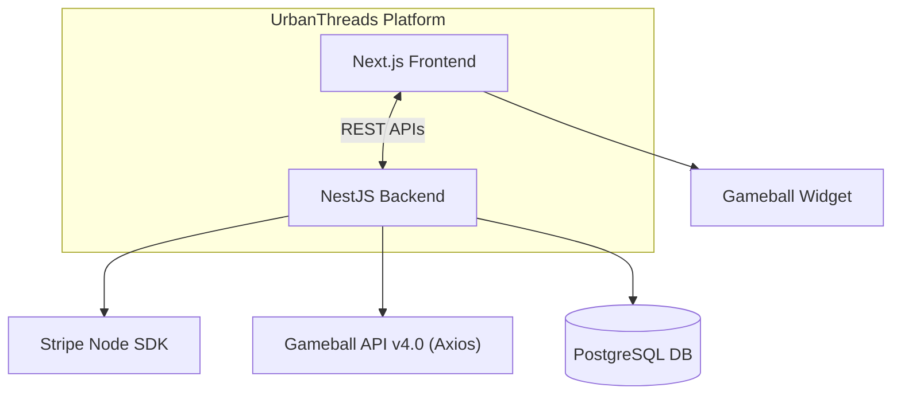
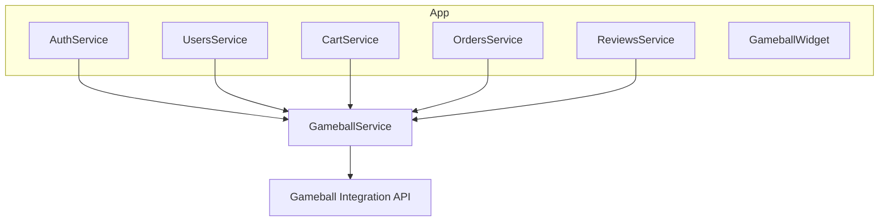
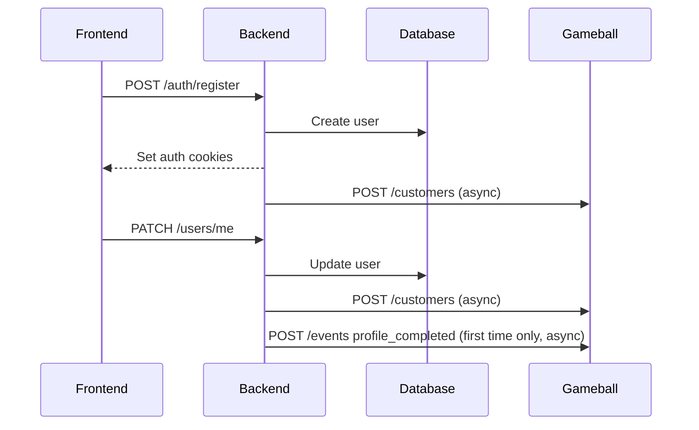
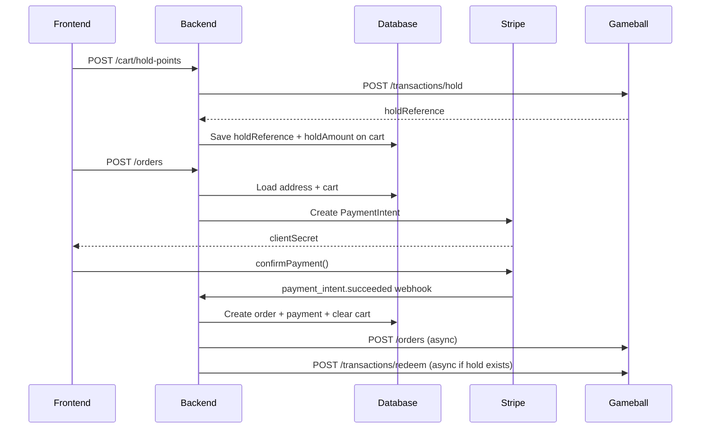
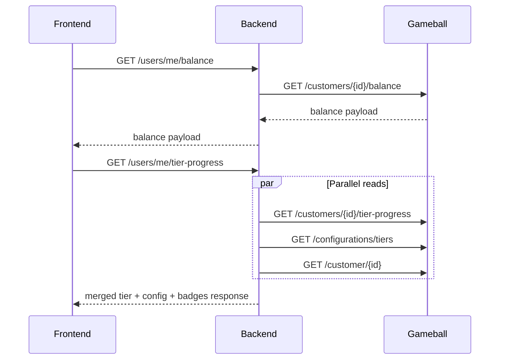

# Gameball Integration — Visual Architecture Reference

System Overview
---

**Key principle:** The frontend NEVER talks to Gameball directly.
All loyalty logic runs server-side through a single `GameballService`.

---

## 2. Integration Overview

All Gameball communication is centralized in a single injectable service:

backend/src/gameball/gameball.service.ts

- HTTP client: Axios instance with preconfigured base URL and auth headers
- Authentication: apikey + secretkey headers (from environment variables)

## 4. API Map: App -> Gameball

| Method&Endpoint                                   | Method                                                                                           | Called From                                                                                                                                         | Purpose                                      |
|---------------------------------------------------|--------------------------------------------------------------------------------------------------|-----------------------------------------------------------------------------------------------------------------------------------------------------|----------------------------------------------|
| `POST /customers`                                 | `createOrUpdateCustomer()`                       | Auth (register), Users (profile update)                           | Create or update a customer profile          |
| `POST /events`                                    | `sendProfileCompletedEvent()`                    | Users (profile completion)                                                                                | Fire behavioral events                       |
| `POST /events`                                    | `sendWriteReviewEvent()`                         | Reviews (on creation)                                                                                 | Fire behavioral events                       |
| `POST /orders`                                    | `trackOrder()`                                  | Orders (after payment success)                                                                         | Track a purchase for point earning           |
| `POST /transactions/hold`                         | `holdPoints()`                                  | Cart (user requests redemption)                                                                            | Hold points for checkout redemption          |
| `DELETE /transactions/hold/{holdReference}`       | `releaseHold()`                                 | Cart (user cancels or replaces hold)                                                                       | Release a point hold                         |
| `POST /transactions/redeem`                       | `redeemPoints()`                                | Orders (after payment success)                                                                         | Finalize point redemption after payment      |
| `GET /customers/{id}/balance`                     | `getCustomerBalance()`                          | Users (balance widget)                                                                                   | Fetch point balance and tier info            |
| `GET /customers/{id}/tier-progress`               | `getCustomerTierProgress()`                     | Users (tier widget)                                                                                      | Fetch tier progression details               |
| `GET /configurations/tiers`                       | `getTierConfigurations()`                       | Users (tier widget)                                                                                      | Fetch all tier definitions                   |
| `GET /customer/{id}`                              | `getCustomerLoyalty()`                          | Users (tier widget)                                                                                      | Fetch full loyalty profile (points, badges)  |
| Local (JWT generation)                            | `getWidgetToken()`                              | Users (embedded widget)                                                                                  | Generate encrypted widget token              |

## 5. Critical Runtime Flows

### A. Customer lifecycle

### B. Checkout + redemption

### C. Loyalty read flow

## 7. Production Advice

### Best practices

| Topic | Recommended approach |
| --- | --- |
| Order earning | Send to Gameball only after payment is truly successful  |
| COD orders | Delay earning/cashback until the order is delivered or cash is collected |
| Refunds/cancellations | Reverse or compensate loyalty transactions; do not leave earned/redeemed points unadjusted |
| Point holds | Track expiry and refresh or release holds when checkout stalls |
| Retries | Queue writes to avoid data loss |
| Customer identity | Use stable UUIDs, not mutable fields like email or phone |
| Secrets | Store in env vars or secret manager only; never commit them |

## 8. Dos and Don’ts Tips

### Do

- **Keep a local order record first** — persist the order and payment to the database before any Gameball call, so the source of truth is always local.
- **When adjusting points manually, make sure your app knows** — We want to avoid incorrect data
- **Make webhook driven flows idempotent** — Stripe may deliver `payment_intent.succeeded` more than once; guard against double earning.
- **Plan reversal flows** refunds and cancellations must adjust loyalty; do not leave earned or redeemed points unadjusted.
- **Replace fire-and-forget with a job queue in production** — `trackOrder()` and `redeemPoints()` can silently fail after payment has already settled; a persistent queue (e.g. BullMQ) ensures replay.
- **Track point hold expiry** — Gameball holds expire after ~10 minutes by default; the cart must track this and refresh or release the hold if checkout stalls.
- **Use a database level lock for concurrent requests** — two simultaneous `holdPoints` calls on the same cart can race; a transactional row lock prevents double-holds.

### Don’t

- **Don’t expose the API key or secret key** — store them in environment variables only; never commit or ship them to the client.
- **Don’t let the frontend call Gameball APIs directly** — all loyalty logic runs server-side through `GameballService`.
- **Don’t silently swallow Gameball errors** — especially for writes (earn, redeem, hold) a silent failure means real money and real points fall out of sync with no trace.
- **Don’t block the checkout response on Gameball** — `redeemPoints()` and `trackOrder()` should not gate the HTTP response back to the user; offload them to a background job so a Gameball timeout never breaks a completed payment.
